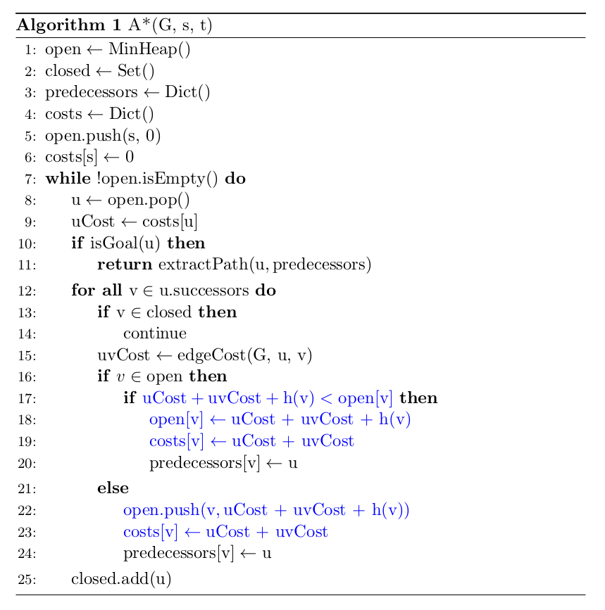

# Coursera-Motion-Planning
This repository contains all assignments for Course: Motion Planning for Self-Driving Cars 

## Motion Planning Capstone Project
The Capstone project (Folder "*Course4FinalProject*") aims at having a functional motion planning stack that can avoid both static and dynamic obstacles while tracking the center line of a lane, while also handling stop signs. The final output is tested in Autonomous Vehicle Simulator [CARLA](https://carla.org/). 

Modules includes:
1. Behavioral Planning through Finte State Machine
2. Static Collision Checking through Circle-based Checking
3. Path Selection through Objective Function
4. Velocity Profile Generation

### Environmental Settings (Windows 7 or later)
Download [CARLA package](https://d18ky98rnyall9.cloudfront.net/uuTN7y7rEemnrA4AsaAhFA_bbb340f02eeb11e9a59e73356fd63643_CarlaUE4Windows.zip?Expires=1607126400&Signature=PIpr1DPLHhDagv1vceL~3N8ogxyWpklIdeZZXiBlN7Da94ZpBqsYZeb~-AummNIGMbqidvdk-kjSV7UPQx9EniUFubXDdRRVpwaoGgO~sO5DZJ6xmZwDj8DlUJpKdBaLe1DxWOPetr~KkEWLRHP6i-y6M16JMLq91sz5LnLp8tw_&Key-Pair-Id=APKAJLTNE6QMUY6HBC5A) with test map prepared by Coursera. File "*CARLA-Setup-Guide-_Windows-x64_.pdf*" introduces the setup steps and FAQs. 

* Note: ensure that one of Python 3.5.x or Python 3.6.x is installed to run this CARLA version.
* Running the CARLA simulator: In one terminal, start the CARLA simulator at a 30hz fixed time-step: *CarlaUE4.exe /Game/Maps/Course4 -windowed -carla-server -benchmark -fps=30* (change fps to accommodate the GPU power)
* Running the Python client (and controller): In another terminal, change the directory to go into the "Course4FinalProject" folder, under the "PythonClient" folder. Run your controller, execute the following command while CARLA is open: *python module_7.py*.

### Results Visualization
Following gifs shows the vehicle simulation results: In the trajectory figure, yellow line is the controlled vehicle, gree line is the centerline of road, blue crosses is a parked vehicle (static obstacle), red dot is the stop sign and endpoint. 

### Behaviour Planning (behavioural_planner.py)
The behavioural logic in this project required to handle a stop sign. A state machine that transitions between lane following, deceleration to the stop sign, staying stopped, and back to lane following, when it encounters a stop sign. 

*get_closest_index()* and *get_goal_index()* let the behavioural planner know where it is relative to the global path, and to compute the current goal point from the global path. And *transition_state()* function contains the behavioural state machine logic. T

### Path Generation (local_planner.py & path_optimizer.py)
The Path Generation uses spiral path optimization  is given to you. 

*get_goal_state_set()* computes the goal state set (the set of goal points to plan paths to before path selection). *thetaf()* computes the yaw of the car at a set of arc length points for a given spiral, *optimize_spiral()* sets up the optimization problem for a given path. Finally, once the optimization is complete, the resulting spiral will be sampled to generate the path through function *sample_spiral()*.

### Static Collision Checking (collision_checker.py)
this part implements circle-based collision checking on our computed path set using the *collision_check()* function. 

### Path Selection (collision_checker.py)
The path selection portion of the project evaluates an objective function in *select_best_path_index()* over the generated path set to select the best path. The goal of this module is to eliminate paths that are in collision with static obstacles, and to select paths that both track the centerline of the global path. To encourage robust obstacle avoidance, a term is added to penalize how close the planned path is to other paths in the path set that are in collision with a static obstacle.

### Velocity Profile Generation (velocity_planner.py)
This velocity planner will not handle all edge cases, but will handle stop signs, lead dynamic obstacles, as well as nominal lane maintenance. This is all captured in the *compute_velocity_profile()*. Physics functions at the end of the file will be used for velocity planning.  

## Path Planning
The Path Planning project is in Folder *PathPlanning*, which contains path planning algorithms Dijkstra and A*.
### Dijkstra
Dijkstra's search algorithm is implemented on a road network graph. The following figure is the psuedocode of the Dijkstra's search algorithm.

### A*_star*
A* search algorithm is implemented using a Euclidean heuristic on a road network graph.
The following figure is the psuedocode of the A* search algorithm.

## Occupancy Grid Generation
Folder "*OccupancyGrid*" contains the python code for Occupancy Grid Generation. The code implements following modules:
* Gather range measurements of a moving car's surroundings using a lidar scanning function
* Extract occupancy information from the range measurements using an inverse scanner model
* Perform logodds updates on an occupancy grids based on incoming measurements
* Iteratively construct a probabilistic occupancy grid from those log odds updates
